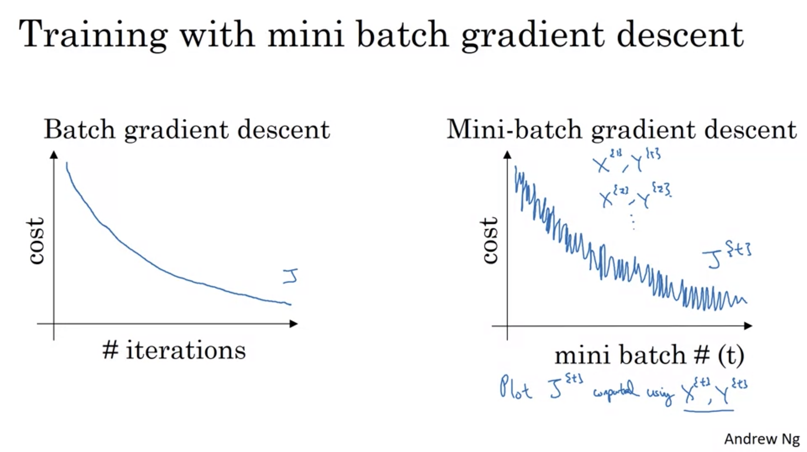
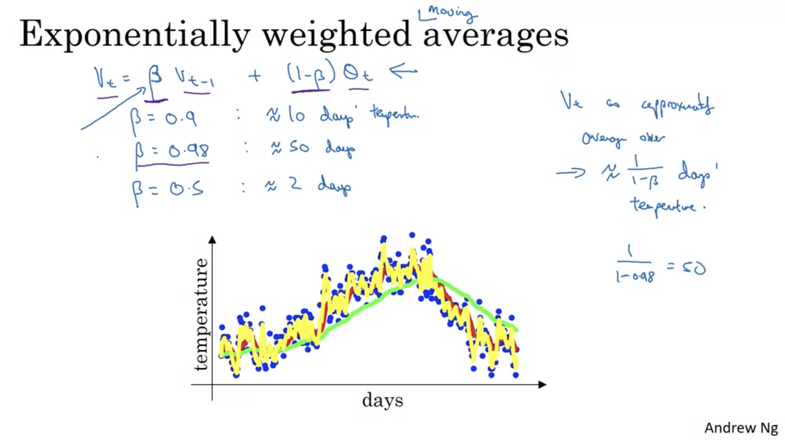
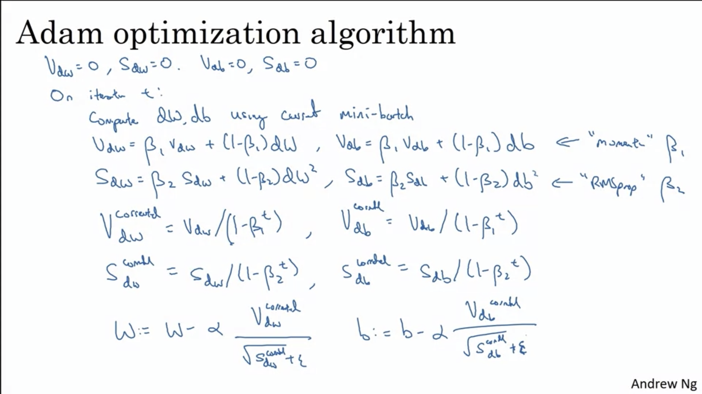
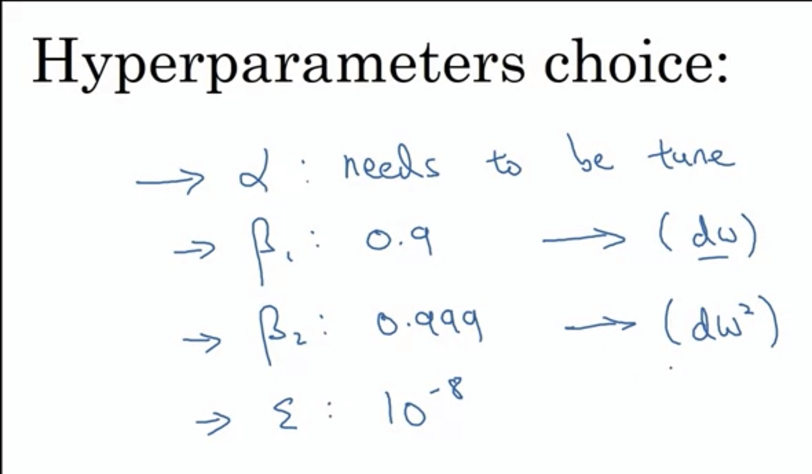

# Week 2

## Optimization Algorithms

Train models with fast optimization algorithms.

1. ___Mini-Batch Gradient Descent__

___Batch vs Mini-batch Gradient Descent__

Vectorization allows you to efficiently compute on m examples. But what if m = 5M examples?

Mini-batch: Batches of 1000 each (5000 mini-batches).

__Batch__: Process entire train set all at the same time.
__Mini-batch__: Process mini-batches of your training set once at a time (forward propagation -> compute cost -> backward prop).

When having large training sets, mini-batch gradient descent runs much faster that normal batch gradient descent.

2. __Understanding Mini-batch Gradient Descent__

Mini-batch gradient descent cost function throught iterations is not a smooth curve but instead a noisier curve. This might be because one of the mini-batches is more easy to learn than the other mini-batches.

One of the __parameters__ that you need to choose is the __mini batch size__.

If mini-batch size = m -> Batch gradient descent. Really smooth curve and fast learning but too long for iteration.
If mini-batch size = 1 -> Stocastic gradient descent (every example is it own mini-batchs). Really noisy curve and lose speed-up obtained for vectorization.

In practice you should use somewhere in between (not too big or small) -> Faster learning and can also make progress without needing to wait to process entire training set.

__Choosing mini-batch size__

If training set is small (e.g. 5000) -> Use batch gradient descent.

Typical mini-batch sizes like power of 2: 64, 128, 256, 512, 1024

Make sure your mini-batch fit in your CPU/GPU RAM memory.    

3. __Exponentially Weighted Averages__

In order to use faster optimization algorithms than mini-batch gradient descent, you should understand __Exponentially Weighted Averages__ which is a key component on several optimization algorithms used to train DNN.

4. __Understanding Exponentially Weighted Averages__

5. __Bias Correction in EWA__

6. __Gradient Descent with Momentum__

Almost always runs faster than the standard gradient descent algorithm.

__Idea__: Compute an EWA of your gradients and then use that gradients to update the weights.

Using gradient descent you end up with an oscillation over the learning surface/loss function that does not allow you to use a much larger learning rate without ending overshooting and diverging.

Algorithm:

On iteration t:
- Compute dw, db on current mini-batch (can be the whole batch)
- Vdw = beta * Vdw + (1 - beta) * dw (moving averages of the derivates)
- Vdb = beta * Vdb + (1 - beta) * db
- w = w - alpha * Vdw, b = b - alpha * Vdb

This will:
- Averages close to 0 on the vertical direction 
- While on the horizontal direction, all the derivatives are pointing to horizontal direction so the averages will be still pretty big.

Analogy of a ball rolling down where:

- dw and db: acceleration
- Vdw and Vdb: velocity
- beta: friction

__Two hyperparameters:__ alpha (learning rate) and beta (controls EWA). Commont value for beta = 0.9 (averaging over last 10 iteration gradients).

7. __RMSprop__

Algorithm:

On iteration t:
- Compute dw, db on current mini-batch (can be the whole batch)
- Sdw = beta * Sdw + (1 - beta) * dw**2 (element wise) <- Hoping to be relatively SMALL
- Sdb = beta * Sdb + (1 - beta) * db**2 <- Hoping to be relatively LARGE
- w = w - alpha * (dw / sqrt(SdW)), b = b - alpha * (db / sqrt(Sdb))

This speeds up the updates in the horizontal direction. In practice both w and b are high dimensional vectors.

Ensure numerical estability, set up your Sdw initial value so you don't end dividing by zero.

8. __Adam: Adaptive Moment Estimation__

Some optimization algorithms might not generalize quite well for thhe wide range of neural networks that you want to train. Adam is one of those algorithms that have been shown to works well on many problems.

Putting together momentum and RMSprop.

Usually you tune alpha an keep beta1 (momentum beta) and beta2 (RMSprop beta) and epsilon fixed.

- Beta1: 0.9
- Beta2: 0.999
- Epsilon: 10**-8

9. __Rate Decay__

One of the things that might increase your optimization algorithms is to slowly decrease your learning rate.

In practice is found as __scheduler__.

Learning rate decay with each epoch.

- Epoch 1: alpha 0.1
- Epoch 2: alpha 0.067
- Epoch 3: alpha 0.05
- Epoch 4: alpha 0.04

Hyperparameters:

- decay_rate
- alpha_zero (initital value of alpha)

10. __The problem of Local Optima__

