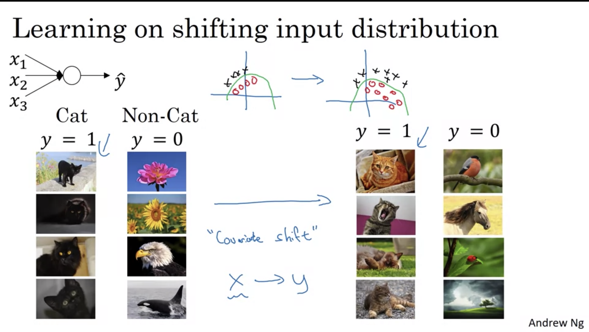

# Hyperparameter Tuning

## Tuning

1. __Tuning Process__

- __alpha__ (Most important)
- __beta (momentum)__ (2nd)
- beta1, beta2, epsilon -> never actually really tuned
- num. layers (3rd)
- __num. hidden units__ (2nd)
- learning rate decay (3rd)
- __mini-batch size__ (2nd)

__How to tune them?__

- __Random sampling__: Don't use a grid, choose them randomly. This allows to search over different values of every dimension, you have more chance to look for different combinations.
- __Coarse to fine__: When sampling different combinations of values you found that certain points worked best and points around it. You might zoom in into that region and sample more densely.

2. __Using scale and appropiate scale to pick hyperparameters__

- Uniform distribution (e.g. 1 to 4 when looking for the n_layers)
- Searching on log scale (e.g. for a range 0.0001 and 1)
- For hyperparameters for EWA, better to look in log scale (log scale)

3. __Hyperparameters tuning in practice: Panda vs Caviar__

- Babysitting one model: when you don't have enough computing power, trying to make this one an only work __(Panda)__
- Train different models in parallel: You have a lot of computing resources, choose the best __(Caviar)__

## Batch Normalization

4. __Normalizing Activations in a Network__

Makes hyperparameter searching more easy making more robust a NN to tuning.

- For any hidden layer, normalize as to train much faster
    - Normalizing before normalizing function is done much more often (__Default__)

_Implementation_:

Intuition: You dont want your hidden units values to have zero mean and standard deviation 1, instead of having different mean and variance to take advantages of non-linearities of the activation function so that's why you can control the range of values with your parameters __sigma__ and __beta__, mean and variance of actviation values are controlled by two parameters.

5. __Fitting batch norm__

Both parameters __beta__ and __gamma__ are learnable.

In practice batch norm is usually applied to mini-batches. You look at the mini-batch and adjust parameters according to just each mini-batch. Also, as you adjust the mean and variance of the layer, there is not point of having the bias parameters.

_Implementing gradient descent with batch norm_

Works with other optimization algos like RMSprop, Adams, Momentum, etc.

6. __Why BatchNorm works?__

- Makes weights in deeper layers more robust to changes to weights in earlier layers of the neural network.

_Learning on shifting input distribution: Covariant Shift_

The idea of this is that if you learn X -> Y mapping and your input distribution changes, you might need to retrain your learning algo.

In a neural network, late layers would see activation values constantly changing as the earlier layers's weigths change.
What __Batch Norm__ does is that reduces the amount that the distribution of these values shift around. No matter how it changes, the mean and variance would remain the same (governed by beta and gamma parameters).

Even thought if the input distribution changes, the amount of that forces the later layers reduces, having more independency of other layers and __speeding up learning of the whole network__.

_Batch Norm as regularization_

- Each mini-batch is scaled by the mean/variance computed on just that mini-batch. Adding some noise to the values z (activations) having a slight regularization effect (not that huge).
- Also, by increasing the mini-batch (e.g. from 64 to 512) size you lose some of this regularization effect.

7. __Batch Norm at Test time__

Given that when training a network that includes batch norm you act over mini-batches, calculating the mean and variance over each mini-batch, at test time as you are using just one example, you might need to do something different.

At test time, you come up with a separate estimate of mean and variance:

- Estimating using EWA across the mini-batches: with all of the mus calculated at every mini-batch calculate the EWA of mean and variance and the __beta__ and __gamma__ parameters learned and use those values at __test time__.

Keras uses the moving average of both mean and variance of the mini-batches it has been seen during training.