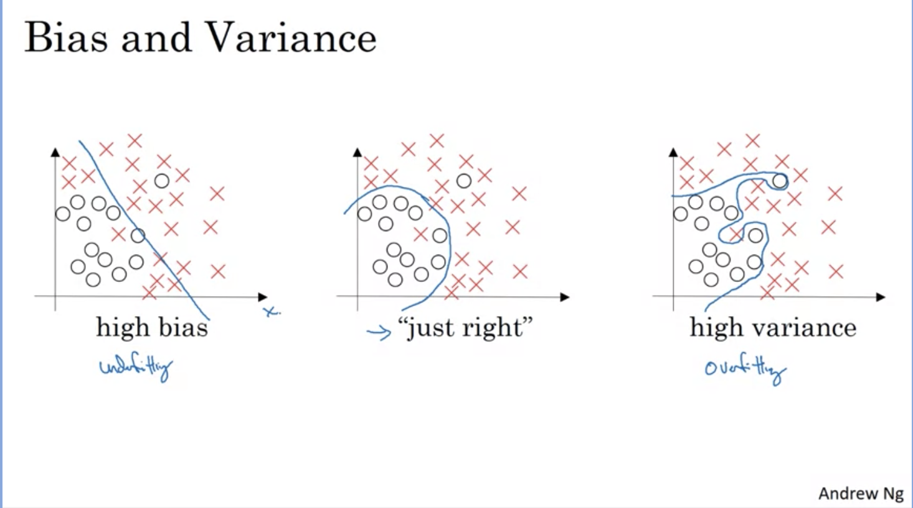
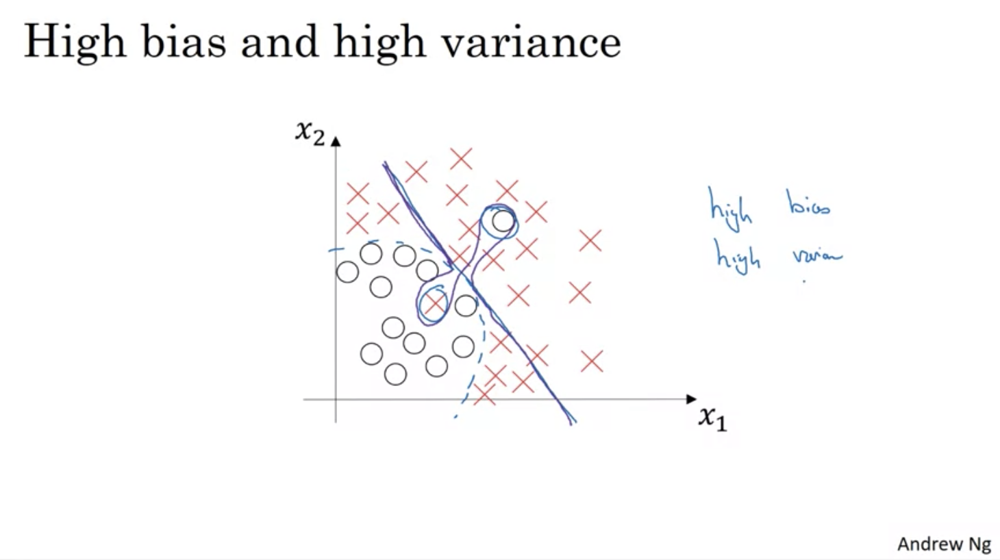
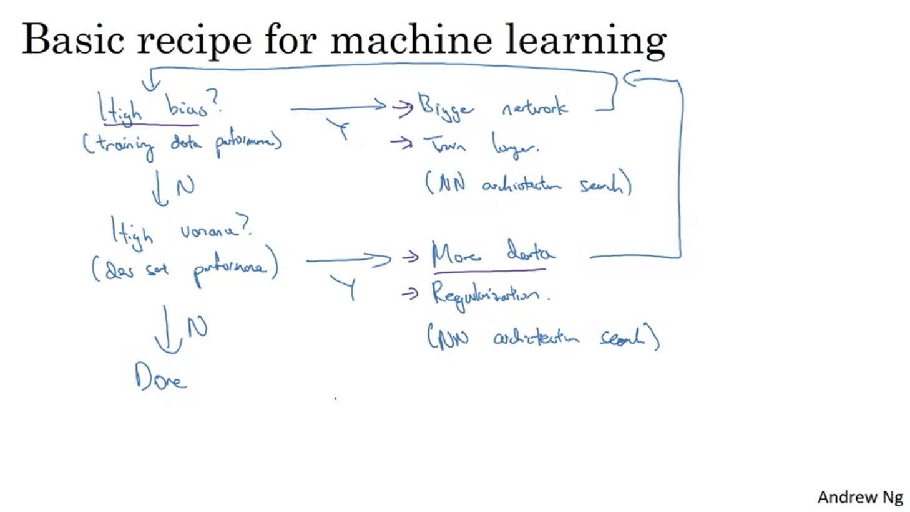

# Week 1

## Setting up your ML Application

Applied ML is a highly iterative process. 

Idea -> Code -> Experiment (repeat)

There are many different fields where deep learning have found success.

- NLP
- CV
- Speeck Recognition 
- Structured Data applications 

Intuitions from one field might not apply to another and the best choices may depend on the amount of data you have, number of input features, compute resources, etc.

Find the best combination of hyperparameters is almost impossible the very first time, so you have to go around this cycle efficiently many times to hopefully find a good choice.

1. __Train/Dev/Test sets__

Traditionally you might take all the data that you have and divive it into different sets:

- __Train set__: Train your algorithm with this data.
- __Hold-out/Cross validation/Dev set__: See which combination of hyperparameters works best over this data.
- __Test set__: Last pass, just use it in the final stage.

Split ratio usually is 70-30 (train, dev) or 60-20-20 (train, dev, test). This changes when you have million scale examples, then you only need 98-1-1 ratios.

### Rule of thumb

Make sure dev and test sets came from the same distribution.

It might be okay to not have a test sets, althought is a recommended practice. The idea is not to overfit to your test set. 

Having separate sets allows to better measure the bias and variance of your algorithm more efficiently.

2. __Bias/variance__

Key values to understand bias and variance are: train and dev set errors.

| Sets                 |     Error     |   Error   |            Error            |           Error           |
|----------------------|:-------------:|:---------:|:---------------------------:|:-------------------------:|
| Train set            |       1%      |    15%    |             15%             |            0.1%           |
| Dev (validation) set |      15%      |    16%    |             30%             |            0.2%           |
|                      | High Variance | High Bias | High Bias and High Variance | Low Bias and Low Variance |

__Assumption__: Base error (usually human or Bayes error) is quite small (~0%) and training and dev sets are drawn from the same distribution.

How high bias and high variance looks like?

3. __Basic Recipe for Machine Learning__

The analysis of train and dev errors allows to assess bias and variance problems in a more systematic way.

Knowing if you have a bias or variance problem can help you choose which approaches are the best to mitigate this problems

## Regularizing your Neural Network

## Setting up your optimization problem

