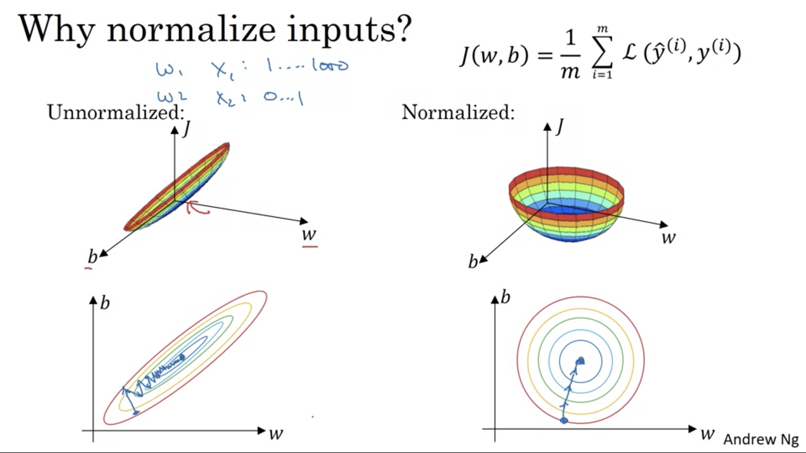

# Week 1

## Setting up your ML Application

Applied ML is a highly iterative process. 

Idea -> Code -> Experiment (repeat)

There are many different fields where deep learning have found success.

- NLP
- CV
- Speeck Recognition 
- Structured Data applications 

Intuitions from one field might not apply to another and the best choices may depend on the amount of data you have, number of input features, compute resources, etc.

Find the best combination of hyperparameters is almost impossible the very first time, so you have to go around this cycle efficiently many times to hopefully find a good choice.

1. __Train/Dev/Test sets__

Traditionally you might take all the data that you have and divive it into different sets:

- __Train set__: Train your algorithm with this data.
- __Hold-out/Cross validation/Dev set__: See which combination of hyperparameters works best over this data.
- __Test set__: Last pass, just use it in the final stage.

Split ratio usually is 70-30 (train, dev) or 60-20-20 (train, dev, test). This changes when you have million scale examples, then you only need 98-1-1 ratios.

### Rule of thumb

Make sure dev and test sets came from the same distribution.

It might be okay to not have a test sets, althought is a recommended practice. The idea is not to overfit to your test set. 

Having separate sets allows to better measure the bias and variance of your algorithm more efficiently.

2. __Bias/variance__

Key values to understand bias and variance are: train and dev set errors.

| Sets                 |     Error     |   Error   |            Error            |           Error           |
|----------------------|:-------------:|:---------:|:---------------------------:|:-------------------------:|
| Train set            |       1%      |    15%    |             15%             |            0.1%           |
| Dev (validation) set |      15%      |    16%    |             30%             |            0.2%           |
|                      | High Variance | High Bias | High Bias and High Variance | Low Bias and Low Variance |

__Assumption__: Base error (usually human or Bayes error) is quite small (~0%) and training and dev sets are drawn from the same distribution.

How high bias and high variance looks like?

3. __Basic Recipe for Machine Learning__

The analysis of train and dev errors allows to assess bias and variance problems in a more systematic way.

Knowing if you have a bias or variance problem can help you choose which approaches are the best to mitigate this problems

## Regularizing your Neural Network

Often help to prevent overfitting or reduce variance.

### L2 Regularization

Euclidean norm of weights vector (L2 Norm). Usually omit the bias regularization component.

Lambda: regularization parameter.

### L1 Regularization

Absolute value of weights vector (L1 norm) times lambda over 2*m (length of the vector). 

Lambda: regularization parameter.

In Deep neural networks you calculate the __"Frobenius Norm"__. The sum is efectuated over the whole matrix (rows and columns).

How do you apply regularization?: Add the regularization term when doing backpropagation, add it to the derivate.

L2 regularization is sometimes called __weight decay__. This is because you are multiplying the weight matrix by a factor equals to:

1 - \frac{\alpha\lambda}{m}

2. __Why regularization helps prevent overfitting?__

__Intuition__

The regularization term penalizes the weight matrices for being to large. Set the weights close to 0 is zeroing out most of the hidden units, reducing complexity of the network, more close to a logistic regression (in the case of feed forward nn).

Not actually zeroing out, but just reduce the contribution of some hidden units, ending with a simple network less prone to overfitting.

If lambda (high) -> weights (decrease) -> z (decrease) -> output of activation in tanh (small) ~ Linear layers (simple networks).

Regularization is kind of playing with complex non-linear boundaries, trying to adjusting to not overfit.

3. __Dropout regularization__

Going throught each layer and set some probability to eliminate a percentage of random nodes, ending with a much smaller nn. This is repeated for each training example.

__Inverted Dropout__

Generate a matrix of zeros and ones and multiply it against the weights matrix and divide the result by the probability of keeping neurons (keep_prob) so the __expected value__ of Z remains the same. You zero-out different patterns of hidden units for different iterations.

Adding the division by keep_prob allows to mantain the same scale in the expected value and allowing to not zeroing out different nodes at test time randomly because this will give you different results. Even taking different zeroing out patterns, making predictions and then averaging out is discouraged because this will give roughly the same results.

4. __Understanding Dropout__

Spread out the weights -> Shrinking the square norm of the weights. Use different keep_prob for the layers you care more about overfitting (usually in the bigger weight matrices, you use a lower keep_prob). Other option is to have layers when you apply and don't apply dropout.

One downside of using dropout -> The cost function is not now well defined.

One thing to do about this: Turn off dropout check the cost function over iterations and then turn-on dropout and see what happens.

5. __Other regularization methods__

- __Data augmentation__
- __Early Stopping__: Based on cost function over iterations, stop if you see the dev cost function curve is diverging from the train cost function curve. Still has one downside: this approach affects both the optimization of cost funciton J and the process of not overfitting.

## Setting up your optimization problem

1. __Normalizing inputs__

Speed up the training process (converge faster).

__Process:__ For every feature, substract the mean and then divide by the standard deviation.

Why to normalize? Easy to optimize and finding the minima in the optimization surface, more symmetrical.

Pretty much always doing a normalization steps does do any harm.

2. __Vanishing / Exploding Gradients__

One of the problem when training very deep neural networks is that sometimes the gradients become very big (explode) or very small (vanish) making training difficult. Activation values will increase or decrease exponentially as a function of the depth of the network.

3. __Weight Initialization for Deep Networks__

A partial solution to vanishing/exploding gradient is a more careful choice of the random initialization of the weights.

__With ReLU activation function__

Initialize weights such as the variance equal to 1/n where n is the number of features. This is done multiplying the random weights by the root square of 2/n (sqrt(2/n)).

This helps setting the weights not too far from 0 but also too big, avoiding in some way the vanishing and exploding gradients respectively.

__Other variants__

- __Xavier initialization:__ If using tanh activation funciton use sqrt(1 / n)

This could be seen as an hyperparameter, the variance of the initial weights.

4. __Numerical approximation of gradients__

Some limits theory, limits definition of derivative used as gradient checking technique, to check if the backpropagation implementation is correct.

lim e -> 0 f(theta+e) - f(theta+e) / (2e)

5. __Gradient Checking__

